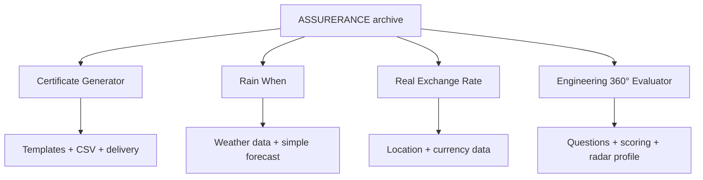

# 🧠 ASSURERANCE

### A collection of product concepts, UX explorations, architecture notes, and engineering experiments.

**A working archive of ideas explored across software products and engineering tools.**

---

## 🧭 What is ASSURERANCE?

ASSURERANCE is a historical project workspace containing several product concepts and technical explorations. The repository is valuable as a record of product thinking, architecture sketches, engineering tasks, and interface research rather than as a single finished application.

<table>
<tr><td width="50%">

### 🪪 Certificate Generator
A workflow for generating personalized certificates from templates and bulk recipient data.

### 🌦️ Rain When
A simple Nigeria-focused weather experience centered on one question: **will it rain today, and when?**

</td><td width="50%">

### 💱 Real Exchange Rate
An exploration of a country-aware exchange-rate experience focused on local market context.

### 🧑‍💻 Engineering 360° Evaluator
A skills-assessment concept for organizations to evaluate engineers across topics and visualize results.

</td></tr>
</table>

## 🔄 Concept map

<strong>🪪 Certificate Generator</strong>

The original concept explored template selection, recipient data import from Comma-Separated Values (CSV) files, unique certificate URLs, bulk email delivery, and downloadable certificate output.

<strong>🌦️ Rain When</strong>

The concept intentionally removes unnecessary weather information and focuses on whether rain is expected and when it may begin. It was designed as a frontend-heavy experience with a backend reverse proxy for protected API access.

<strong>💱 Real Exchange Rate</strong>

The concept explored location-aware country selection, map interaction, and exchange-rate lookup using country/currency codes.

<strong>🧑‍💻 Engineering 360° Evaluator</strong>

Organizations create assessment spaces, candidates answer timed multiple-choice questions, and results are grouped by category for comparison and radar/spider-chart visualization.

## 🛠️ Technology themes

Historical notes reference React, Tailwind CSS, Chakra UI, Chart.js, Node.js, TypeScript, PostgreSQL, MongoDB, Prisma, Python, FastAPI, and email/API integrations.

## 📚 Why this repository matters

The archive preserves early product exploration, interaction ideas, data models, and engineering decisions. Individual concepts may later become independent products or research branches.

## 🔐 Ownership

This repository contains proprietary product concepts, source material, documentation, and design research. See [`LICENSE`](./LICENSE) for usage terms.
